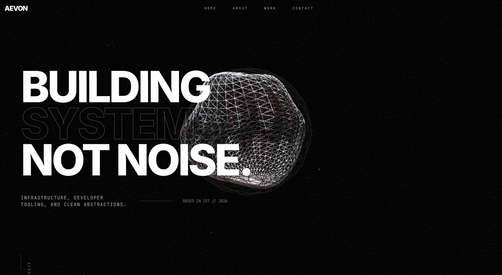

### I am a developer that believes hardware is a luxury, but logic is a constant. For four years, I have documented the evolution of decentralized commerce while operating on a 6-year-old machine and 512GB of storage. This site is a living archive of every commit, every failure, and every version of the Zero Cut Protocol. I don't build for the hype; I build for the edge cases.

[**Continue to the Archive ->**](blog/index.md)

> "Death is nothing, but to live defeated and ingloriuous is to die daily." - Napoleon Bonaparte
